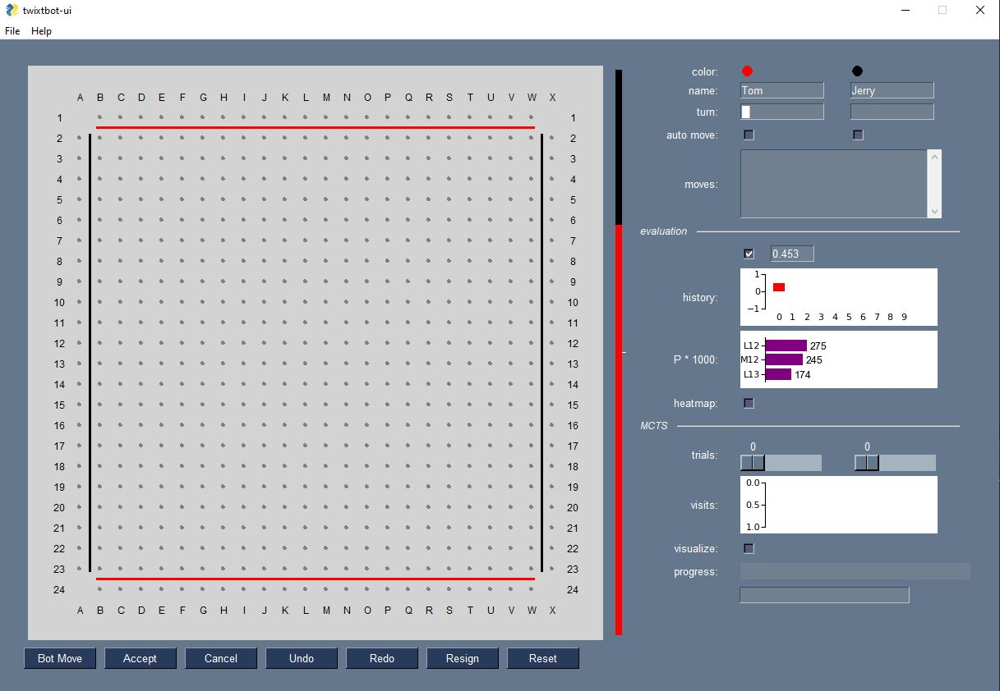
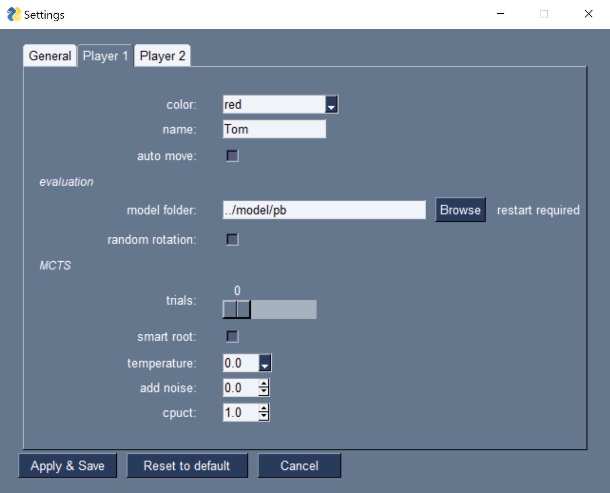

# twixtbot-ui

twixtbot-ui is a graphical user interface on top of [twixtbot](https://github.com/BonyJordan/twixtbot). twixtbot is an engine for the game [TwixT](https://en.wikipedia.org/wiki/TwixT)
that has been developed by Jordan Lampe. It uses [AlphaZero](https://en.wikipedia.org/wiki/AlphaZero) techniques, i.e. a neural network plus Monte-Carlo-Tree-Search and plays extremely strong. See its ratings at [littlegolem.net](https://littlegolem.net/jsp/games/gamedetail.jsp?gtid=twixt). It's brilliant! Big round of applause to Jordan!

twixtbot-ui brings twixtbot to your desktop in a simple standalone python program. You can play against the bot, have it evaluate past games or have two bots play against each other using different settings.

twixtbot-ui comes with all the neccessary twixtbot files in subfolder `./backend` so there is no dependency to the twixtbot repository. The twixtbot code runs as part of twixtbot-ui; no server needs to be started beforehand.   


## Get started

#### Windows Installer
For Windows 10 there is an [executable installer](https://c.web.de/@337132546481460455/4HW9ryQDSuulyIESaKfc_g). It will install all necessary files and create a shortcut 'twixtbot-ui' in the Start Menu. The shortcut points to a script ```winlaunch.py``` that starts twixtbot-ui. The installation requires ~1.1 GByte of free disk space.

#### Manual Installation
For manual installation make sure you have Python3 installed. The Python version needs to support tensorflow2. As of March 2021 this is true for Python 3.6, 3.7 and 3.8 (64bit). Do not use Python 3.9. Consider using [virtual environments](https://docs.python.org/3/tutorial/venv.html) to switch between multiple Python versions on your system. To check the current version, use the following commands: 

```
python --version
python -c "import struct; print(8 * struct.calcsize('P'))"
```

Clone this repository using the following command or download the repository as ZIP file and extract it.

```
git clone https://github.com/stevens68/twixtbot-ui
```

At the command line, change to the ```twixtbot-ui``` directory &ndash; or ```twixtbot-ui-master``` if you extracted a ZIP file &ndash; and install the necessary modules:

```
python -m pip install -r requirements.txt
```

Change to directory `./src` and start twixtbot-ui:

```
cd src
python tbui.py
```

Ignore the tensorflow warnings and confirm the pop-up message that says that a settings file will be created. Wait a few seconds until the bots have been initialized. You should see the GUI with a clean TwixT board and the control bar on the right:





## Play TwixT

### Human move

Place pegs by clicking on the board. You are in control of player1 and player2 at any time. Pegs are linked automatically. Change the settings *allow swap* and *allow scl* (*File -> Settings...*) to enable or disable the swap rule or self-crossing links, resp. Link removal is not supported.

### Bot move

There is one dedicated bot for each player. The bots can have different settings. Click button *Bot Move* to let the reponsible bot do the next move. If you switch on *auto move* the bot will make its moves automatically.

### Swap rule 

Human players *swap* by clicking on the first peg. The peg will be replaced by a black peg, mirrored at the diagonal. twixtbot has its own swap policy (see `./backend/swapmodel.py`). The bot will swap any first move on row 7 to 18 plus moves B6, C6, V6, W6, B19, C19, V19, W19.

### Undo, Redo, Resign, Reset

Click these buttons to undo the last move, redo undone moves, resign a game or start a new game, resp. You cannot click these buttons during MCTS.

## Evaluation

By default, both bots share the same neural network in folder `./model/pb`. The network has been taken from [twixtbot](https://github.com/BonyJordan/twixtbot) in Dec 2020. Some manual adjustments were necessary for tensorflow2 to read it. If you want to use another network that you have trained using twixtbot, have a look at the files in folder `./convert` to see what needs to be adjusted before twixtbot-ui can use it. Put the network into a separate folder and configure the folder in *File -> Settings...*.  

Note that the network was trained with self-crossing links allowed, which can lead to incorrect evaluations in certain cases, if *allow scl* is set to false (default). It doesn't make a big difference though in most cases.

By default, the evaluation output of the network is displayed after each move. If you do not want to be distracted or influenced you can uncheck the *evaluation* checkbox. This also hides the *MCTS visits* bar chart.

#### value head

After each move, the network evaluates the board. The value head [-1.0..1.0] indicates the probability for a win of player1 and player2, resp. The value is displayed as a float number and as a vertical bar. Past values are recorded in a history bar chart.<br>

#### policy head

The policy head of the network evaluates each legal move. These p-values in range [0..1] indicate how promising a certain move for the current player is. A bar chart on the right shows the top three moves and their p-values. Switch on the *heatmap* checkbox below the bar chart to visualize all p-values > 0. The bigger and greener the spots, the better the p-value. The color coding is:
+ light green: close to 100% of best p
+ light blue: close to 50% of best p
+ dark blue: close to 0% of best p<br>


## MCTS

The network is strong enough to win against most human players. If you want the bot to play even stronger you can switch on Monte-Carlo-Tree-Search. To do so choose a number of *trials* > 0. The more trials, the bigger the tree, i.e. the more boards will be evaluated. twixtbot-ui starts MCTS in a separate thread. Progress info is updated every 20 trials. The top three moves with the most visits are listed.<br><br> 
If *smart accept* is switched on, the max number of trials will be reduced automatically depending on the visit difference between the leading move and the second best.<br><br>
If you check the *visualize* checkbox, the current line with the most visits will be displayed on the board so you can get an idea in which direction the bot is "thinking". In the example below, the line is S18 (3185), R14 (230), R11 (193), etc. 


In many cases MCTS will not lead to a different move than initially suggested by the network. Click *Accept* to accept the current best move. Click *Cancel* to abort; this will also set *auto move* to false. 

Note that for the first move and the swap move the bot does not use the evaluation of the network and MCTS.

## Settings

All settings can be changed and saved via *File -> Settings...*. Most changes are effective immediately and can be applied in the middle of a game. Click button *Reset to default* to reset the values in all three tabs. 



Parameters *auto move* and *trials* can also be changed in the control panel of the main window. These changes won't be saved when you exit the program. In the main window, to see the current settings in a tooltip, hover the mouse over the *auto move* checkboxes. 

#### Tab *General*

+ *allow swap*: switch on the swap rule (default: true)
+ *allow self crossing links*:  paper-and-pencil variant of TwixT (default: false), 
+ *board size*: number of pixels of a side of the board (default: 600)
+ *show labels*: display labels for rows and columns (default: true)
+ *show guidelines*: display lines that lead into the corners (default: false)
+ *show cursor label*: display the coordinates in a tooltip at the mouse cursor (default: false)
+ *highlight last move*: display a yellow circle around last peg (default: false)
+ *smart accept*: during MCTS, reduce the max number of trials automatically according to the lead of the best move (default: true)
+ *resign threshold*: if evaluation is bigger than this threshold - in favor of the opponent - the bot will resign (default: 0.95)

+ *log level*: verbosity of log messages (default: ERROR)


#### Tab *Player 1 / 2*

- *color*:  choose your favorite colors for the players (default: red / black)
- *name*: choose your favorite player names (default: Tom / Jerry)
- *auto move*: if true, the bot makes a move autmatically (default: false)
- *random rotation*: if true, the bot randomly chooses one of the four equivalent boards (rotation / mirroring) for evaluation (default: false)
- *model folder*: no reason to change this unless you have a second network (default: `../model/pb`)
- *trials*: number of MCTS iterations. Set it to 0 to switch off MCTS (default: 0)
- *smart root*: if true, the leading move is not visted if it is more than one visit ahead. Of the remaining moves the one with the best UCB is chosen instead (default: false) 
- *temperature*: controls the policy which move is taken after MCTS: 
  - 0.0: choose move with highest number of visits; random choice for tie-break (default)
  - 0.5: random choice using probability distribution of squared number of visits
  - 1.0: random choice using probability distribution of number of visits   
- *add noise*: add dirichlet noise to P using alpha = 0.03:<br>
    P<sub>i<sub>new</sub></sub> := (1 - add_noise) * P<sub>i</sub> + add_noise * Dir(0.03)<br>
    default: add_noise = 0, so P remains unchanged
- *cpuct*: MCTS constant that balances exploitation vs. exploration (default: 1.0)<br>When selecting a branch down the tree, MCTS visits the node with the highest Upper Confidence Bound (UCB):<br>
U<sub>i</sub> := Q<sub>i</sub> + c<sub>puct</sub> * P<sub>i</sub> * sqrt(n + 1) / (n<sub>i</sub>+1)<br>
where Q<sub>i</sub> is initially 0 and updated after each visit depending on the score of the subtree:<br>
Q<sub>i<sub>new</sub></sub> := Q<sub>i</sub> + (score<sub>sub</sub> - Q<sub>i</sub>) / n<sub>i</sub><br>
Decrease c<sub>puct</sub> to move the needle towards exploitation, i.e reduce the influence of P

[This site](https://medium.com/oracledevs/lessons-from-alphazero-part-3-parameter-tweaking-4dceb78ed1e5) has more details on temperature, dirichlet noise and cpuct.

## Loading and saving games 

Choose *File -> Open File...* to load games stored in [T1J](http://www.johannes-schwagereit.de/twixt/T1j/index.html) file format (\*.T1) or littlegolem.net format (\*.tsgf). It will take a few seconds to re-calculate the evaluation history. After a game is loaded, the player names and the board are updated and you can continue to play as usual. See sample files in folder `./games`. Note that the value of *self crossing links* is applied when loading a game. Choose *File -> Save file...* to save a game in T1J format; tsgf is not supported as a target. 

#### T1J files

When reading a T1J file all rows except those for moves and player names are ignored. Each game is considered "unswapped" with player 1 to start. You can prepare T1J-like files in an editor: The first 13 lines need to be comments except lines 4 and 5 for the player names. Append one line per move in upper or lower case with *swap* and *resign* being valid moves. Note that these files cannot be read by T1J.

```
#
# 
# 
Tom # player 1
Jerry # player 2
# 
# 
# 
# 
# 
# 
# 
# 
e15
swap
f17
H18
P12
resign
```

### Keyboard shortcuts

<table id="verticalalign">
    <thead>
        <tr>
            <th>Menus</th>
            <th>Buttons</th>
            <th>Checkboxes</th>
            <th>Sliders</th>
        </tr>
    </thead>
    <tbody>
        <tr>
            <td align="left" valign="top"><i>File</i>: <kbd>Alt</kbd><kbd>f</kbd><br><i>Help</i>: <kbd>Alt</kbd><kbd>h</kbd></td>
            <td align="left" valign="top"><i>Bot Move</i>: <kbd>Alt</kbd><kbd>b</kbd><br><i>Accept</i>: <kbd>Alt</kbd><kbd>a</kbd><br><i>Cancel</i>: <kbd>Alt</kbd><kbd>c</kbd><br><i>Undo</i>: <kbd>Alt</kbd><kbd>u</kbd><br><i>Redo</i>: <kbd>Alt</kbd><kbd>d</kbd><br><i>Resign</i>: <kbd>Alt</kbd><kbd>g</kbd><br><i>Reset</i>: <kbd>Alt</kbd><kbd>r</kbd></td>
            <td align="left" valign="top"><i>auto move</i> 1: <kbd>Alt</kbd><kbd>1</kbd><br><i>auto move</i> 2: <kbd>Alt</kbd><kbd>2</kbd><br><i>evaluation</i>: <kbd>Alt</kbd><kbd>e</kbd><br><i>heatmap</i>: <kbd>Alt</kbd><kbd>m</kbd><br><i>visualize</i>: <kbd>Alt</kbd><kbd>v</kbd></td>
            <td align="left" valign="top"><i>MCTS trials</i> 1: <kbd>Alt</kbd><kbd>&#8592</kbd>, <kbd>Alt</kbd><kbd>&#8594</kbd><br><i>MCTS trials</i> 2: <kbd>Alt</kbd><kbd>Shift</kbd><kbd>&#8592</kbd>, <kbd>Alt</kbd><kbd>Shift</kbd><kbd>&#8594</kbd></td>
        </tr>
    </tbody>
</table>


### Contributors

* [agtoever](https://github.com/agtoever):  
Load tsgf Files, Save Files, Evaluation History, Heatmap, Init Progressbar, Highlight Last Move, Hide Evaluation, Redo, Logging
